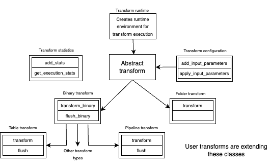

# Transform

Transforms are the heart of DPK. DPK defines abstract base classes for transforms that require 
implementations to adhere to certain rules. Derived classes implement the desired transformations 
and DPK can process them generically, regardless of the implementation details. Additionally,
DPK defines a set of helper transform classes, that allow to configure them, adjust runtime 
behaviour, collect execution statistics, etc. 

The main classes of the transform definitions are presented in Figure below

## Transform types

All transforms are derived from the
[AbstractTransform class](abstract_transform.py). This class provides no functionality and is used as 
a marker that a given class implements transform.
There are currently two types of transforms defined in DPK:

* [AbstractBinaryTransform](binary_transform.py) which is a base
  class for all data transforms. Data transforms convert a file of data producing zero or more data 
  files and metadata. Specific classes of the binary transform are
  [AbstractTableTransform](table_transform.py) that consumes and produces data files containing 
  [pyarrow tables](https://arrow.apache.org/docs/python/generated/pyarrow.Table.html) and [AbstractPipelineTransform](pipeline_transform.py) that creates
  pipelined execution of one or more transforms. For more information on pipelined transforms refer to
  [Pipeline Transform](pipelined_transform.md)
* [AbstractFolderTransform](folder_transform.py) which is a base
  class consuming a folder (that can contain an arbitrary set of files, that need to be processed together)
  and proces zero or more data files and metadata.

## Transform support classes

In addition to transform itself, library provides several support classes, that simplify creation
and maintenance of transforms:
* [transform configuration](transform_configuration.py) - to simplify long term maintenance the framework separates 
  transform's implementation from its configuration. This allows change platform parameters through configuration
  without any changes to the implementation. 
  > ***Note*** that pipelined transform is configured differently from ordinary transforms, see [Pipeline Transform](pipelined_transform.md) for more details
* [transform runtime](transform_runtime.py) - this class support transform's ability to leverage 
  additional capabilities supported by a given pipeline, for example shared classes in the case of
  pure Python or shared actors in the case of Ray. It also provides support for folder transforms - 
  list of folders to process. Supported pipelines provide default implementation of this class and the
  user only have to implement it if he really needs to use mentioned above capabilities or creating a folder 
  transform
* [transform statistics](transform_statistics.py) - this class is a very simple singleton dictionary 
  allowing both runtime and transform implementation collect execution statistics (metadata)

