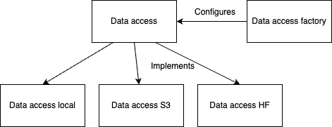

# Data Access

## Introduction
For transforms to function correctly, they need to be able to read and write data. As data for 
transforms can come from disk, S3 compatible storage, Hugging Face Datasets, etc., DPK introduces 
a data abstraction layer that allows the framework to execute data operations generically, 
abstracting out details accessing data for specific storage locations. The 
[Data Access base class](data_access.py) included in the framework provides an abstraction for common 
operations that are relevant to data processing, rather than operations that are specific to 
particular storage locations. In addition to typical methods like file read/write, this class 
also provides a set of higher-level methods useful for data processing. For example, `get_files_to_process`, 
can retrieve all the files with a given extension from a source directory. It can also compare this 
list with the list of existing files in the destination directory and return back a list of only the 
files that exist in the source directory but not in the destination directory. This feature effectively 
supports checkpointing. If the current run fails and it is restarted, it will only process the files 
that have not been processed yet.

The main classes of the data access layer are presented in Figure below




## Data Access
Data access base class described above is an abstract class defining overall capabilities. The packege provides 
several concrete files implementing this class for several different storage mechanisms:
* [local file system](data_access_local.py) - this data access is mostly used for local testing
or accessing a PVC drive
* [s3](data_access_s3.py) - this works for most of S3 compatible and is one of the mainly used 
data accesses
* [HF data sets](data_access_hf.py) - this data access supports 
[Hugging Face data sets](https://huggingface.co/docs/hub/datasets-overview) and is used to 
process data from(to) HaggingFace datasets.

A transform can be using 2 data access - one for input one for output (if input and output
are using the same data access for both input and output, a single data access can be used)
To define data access for a given transform, the following needs to be defined:
* Input data access:
  * input folder
  * extensions of the files of interest
  * extensions of checkpointed files
  * maximum file count (useful for debugging)
  * random sampling of the input files (useful for debugging)
  * Checkpointing  - determines the set of input files that need processing
  (i.e. which do not have corresponding output files).
* Output data access:
  * output folder

To further simplify usage (and switching) of data access, we introduce 
[data access factory](data_access_factory.py) allowing to configure and change data
access through configuration without any code changes.

## Data Access factory

Data access factory allows to configure data access (including the type), validate 
configuration and create a desired data access. to allow configuration of multiple
data accesses, each data access factory can have a unique prefix, that is prepended
to every data access factory parameter, thus ensuring that a given parameter belongs
to a given data factory. Below is the list of parameters for the factory with prefix
`data`:

```commandline
  --data_s3_cred DATA_S3_CRED
                        AST string of options for s3 credentials. Only required for S3 data access.
                        access_key: access key help text
                        secret_key: secret key help text
                        url: optional s3 url
                        region: optional s3 region
                        Example: { 'access_key': 'access', 'secret_key': 'secret', 
                        'url': 'https://s3.us-east.cloud-object-storage.appdomain.cloud', 
                        'region': 'us-east-1' }
  --data_s3_config DATA_S3_CONFIG
                        AST string containing input/output paths.
                        input_folder: Path to input folder of files to be processed
                        output_folder: Path to output folder of processed files
                        Example: { 'input_folder': 's3-path/your-input-bucket', 
                        'output_folder': 's3-path/your-output-bucket' }
  --data_local_config DATA_LOCAL_CONFIG
                        ast string containing input/output folders using local fs.
                        input_folder: Path to input folder of files to be processed
                        output_folder: Path to output folder of processed files
                        Example: { 'input_folder': './input', 'output_folder': '/tmp/output' }
  --data_hf_config DATA_HF_CONFIG
                        ast string containing hf_token/input/output folders using hf fs.
                        hf_token: HF token required for write operation
                        input_folder: Path to input folder of files to be processed
                        output_folder: Path to output folder of processed files
                        Example: { 'hf_token': './input', 'input_folder': './input', 
                        'output_folder': '/tmp/output' }
  --data_max_files DATA_MAX_FILES
                        Max amount of files to process
  --data_checkpointing DATA_CHECKPOINTING
                        checkpointing flag
  --data_files_to_checkpoint DATA_FILES_TO_CHECKPOINT
                        list of file extensions used for checkpointing.
  --data_files_to_use DATA_FILES_TO_USE
                        list of file extensions to choose for input.
  --data_num_samples DATA_NUM_SAMPLES
                        number of random input files to process
```

## Creating DAF instance

```python
from data_processing.data_access import DataAccessFactory
daf = DataAccessFactory(cli_arg_prefix="myprefix_")
```
The parameter `cli_arg_prefix` is prefix used to look for parameter names
starting with prefix `myprefix_`. Generally the prefix used is specific to the
transform.

## Preparing and setting parameters
```python
from argparse import Namespace

s3_cred = {
    "access_key": "XXXX",
    "secret_key": "XXX",
    "url": "https://s3.XXX",
}

s3_conf={
    'input_folder': '<COS Location of input>', 
    'output_folder': 'cos-optimal-llm-pile/somekey'
}

args = Namespace(
    myprefix_s3_cred=s3_cred,
    myprefix_s3_config=s3_conf,
)
assert daf.apply_input_params(args)

```
`apply_input_params` will extract and use parameters from `args` with
prefix `myprefix_`(which is `myprefix_s3_cred` and `myprefix_s3_config` in this example).

The above is equivalent to passing the following on the command line to a runtime launcher
```shell
... --myprefix_s3_cred '{ "access_key": "XXXX", "secret_key": "XXX", "url": "https:/s3.XXX" }'\
    --myprefix_s3_config '{ "input_folder": "<COS Location of input>", "cos-optimal-llm-pile/somekey" }'
```

## Create DataAccess and write file

```python
data_access = daf.create_data_access()
data_access.save_file(f"data/report.log", "success")
```

Call to `create_data_access` will create the `DataAccess` instance (`DataAccessS3` in this case) .
`save_file` will write a new file at `data/report.log` with content `success`.

When writing a transform, the `DataAccessFactory`(s) are generally created in the
transform's configuration class and passed to the transform's initializer by the runtime.

