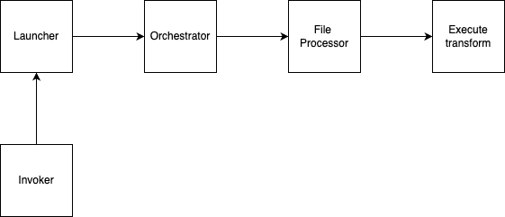

# Runtime

This package contains generic classes enabling transform's invocation base functionality for any
runtime. The main classes of the runtime are presented in Figure below

The following are the actors included here:

* [TransformExecutionConfiguration](execution_configuration.py) is a very simple class keeping an information of the job type
  (Ray version of this class add some additional parameters). 
* [AbstractTransformFileProcessor](transform_file_processor.py) is a class orchestrating processing of a single file.
It reads the file, invokes a transform to process it and stores any results
* [TransformOrchestrator](transform_orchestrator.py) implements the main transform execution functional steps, including 
  obtaining a list of files to process, invoking `TransformFileProcessor`, to process individual file. 
  After all files are processed, obtaining execution statistics to build execution metadata and writes it out. 
  Splitting this class in the multiple methods allows for easy overwriting overall functionality to specialize 
  its execution for specific use cases.
* [orchestrate](transform_orchestrator.py) is a function leveraging `TransformOrchestrator` to orchestrate 
  overall data processing
* [AbstractTransformLauncher](transform_launcher.py) is a class implementing collecting of the transform parameters 
  from the command line launching overall execution
* [TransformInvoker](transform_invoker.py) although `TransformLauncher` provides a very convinient mechanism 
  for starting transform execution from the command line, sometimes, it is necessary to invoke the execution 
  using APIs. Such functionality is implemented by this class.

